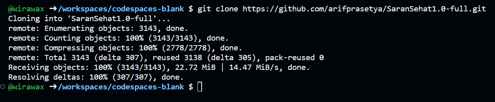
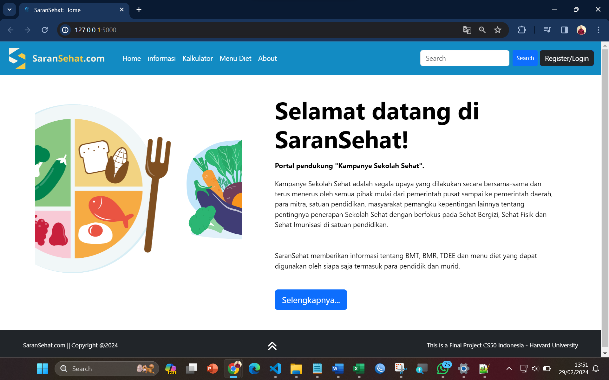
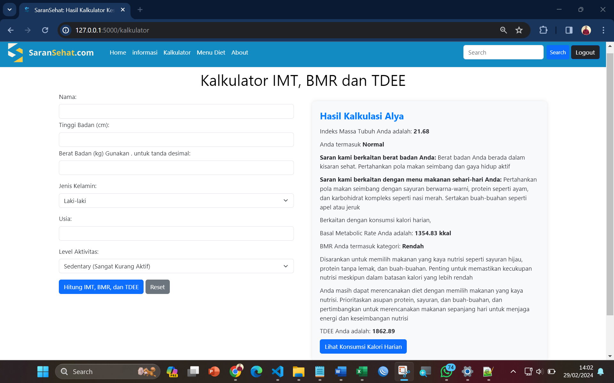
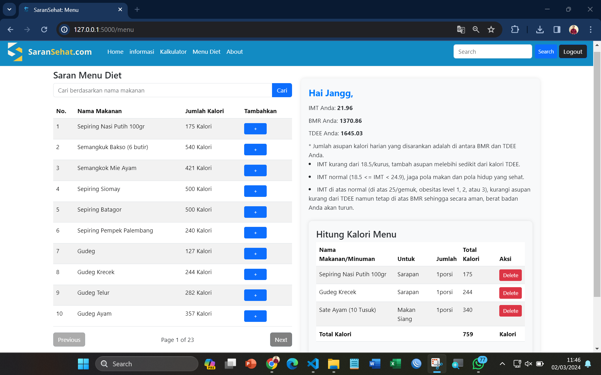

###**1. Application Description**
Healthy School Campaign is an effort done together with all the stakeholders (government, corporation, schools, society) and continuously to be focused on “Healthy Nutrition, Healthy Physic, and Healthy Immunization at school.” In connection with the campaign, our application, named Saran Sehat (or Healthy Suggestions in English), gives users the information on Body Mass Index, daily calories consumption and dietary menu which every one can use, including the teachers and students.
Link to the video: [Saran Sehat](https://youtu.be/V1I_ZK46RkU)

Aim of the Project:
1. Let the users know about Body Mass Index.Users can also calculate their body mass index and get the suggestions about healthy lifestyle concerning their BMI.
2. Let the users calculate their basal metabolic rate (BMR) and total daily energi expenditure (TDEE) and get the suggestions about what healthy meal should to take concerning their BMR and TDEE

Creators of the project are:
1. Arif Eka Prasetya
2. Wirawan Yogiyatno
3. Reti Sudarsih
   
###**2. Softwares/Modules/Libraries**
To use <code>Saran Sehat</code>, you need to have the following softwares installed in your local computer:
1. Python 3.12 <a href="https://www.python.org/downloads/" rel="nofollow">https://www.python.org/downloads/</a>
2. PIP <a href="https://pip.pypa.io/en/stable/" rel="nofollow">https://pip.pypa.io/en/stable/</a>
3. CS50 Library for Python <a href="https://cs50.readthedocs.io/libraries/cs50/python/" rel="nofollow">https://cs50.readthedocs.io/libraries/cs50/python/</a>
4. Flask <a href="https://flask-session.readthedocs.io/en/latest/" rel="nofollow">https://flask-session.readthedocs.io/en/latest/</a>
5. Git <a href="https://git-scm.com/doc" rel="nofollow">https://git-scm.com/doc</a>
####**2.1 Install Python**
Refer to this article to install and configure Python:
<a href="https://realpython.com/installing-python/" rel="nofollow">https://realpython.com/installing-python/</a>

####**2.2 Install PIP**
Refer to this documentation to install PIP: 
<a href="https://pip.pypa.io/en/stable/installation/" rel="nofollow">https://pip.pypa.io/en/stable/installation/</a>

####**2.3 Install CS50 for Python**
Use the following command in your terminal to install CS50 library for Python
<code>$ pip3 install cs50</code>
The command will also install all other modules used in this project.

####**2.4 Install Flask-Session**
Use the following command in your terminal to install Flask-Session:
<code>$ pip3 install Flask-Session</code>

####**2.5 Install and Configure Git**
Refer to this documentation to install and configure Git: <a href="https://git-scm.com/book/en/v2/Getting-Started-Installing-Git" rel="nofollow">https://git-scm.com/book/en/v2/Getting-Started-Installing-Git</a>

   
###**3. Clone and Launch The Application**
1. Navigate to the project repository using the following link:
2. Open terminal window, and change directory to your own choice
3. Use the following command to clone the project
   <code>$ git clone https://github.com/arifprasetya/SaranSehat1.0-full.git</code>
Make sure the clone process is finished before proceeding to the next step. The following screenshot shows the completed clone
   
4. Change directory to the application directory
   <code>$ cd SaranSehat1.0-full</code>
5. Launch the application
   <code>$ flask run</code>
   The application runs on http://127.0.0.1:5000/ by default. The following landing page should appear
   

###**4. Using The Application**
####**4.1 As member**
To use the application as a member, you must first register for an account. Navigate to http://127.0.0.1:5000/register, and complete the registration process by providing username, name, password, and email correctly. You will be logged-in automatically to the landing page with flash message telling you that you are succesfully login.

To calculate BMI, BMR, and TDEE, click the Kalkulator menu at the navigation bar. You must fill height, weight, age, sex, and activity level then click the button. The page will display the calculation result.

You can also prepare your daily meal intake. Click the Menu Sehat. You will be delivered to a page where you can search meal based on the meal's name or calories. Once you get the result, you can add the meals into your daily intake meal plan. The application will calculate total calories of your plan and make suggestions after comparing the calories from the plan and the calories recommended from BMR and TDEE calculation.

####**4.2 As administrator**
You can not register yourself as an administrator. To get a glimpse about what the administrator can do, navigate to login page, and use the following credential:
<code>username: Luffy
 password: Captain21</code>
 
As an administrator, you can do the following:
1. Add, update, or delete food(s)
2. Edit, or delete member(s) 

###**5. FAQs**
1. **Q: "I want to calculate BMI and/or BMR and/or TDEE my students without having them registered. Can I do that?"**
   A: Yes. As registered member, you can calculate other person's BMI, BMR, and TDEE. That's why we provide Name field in Kalkulator Menu
2. **Q: "Can I add food(s) entry to the food database?"**
   A: No. Adding food entries, changing them, and deleting them are administrator privileges.
